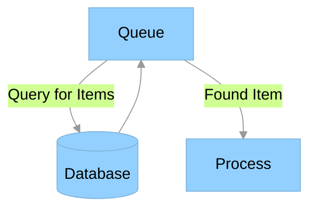
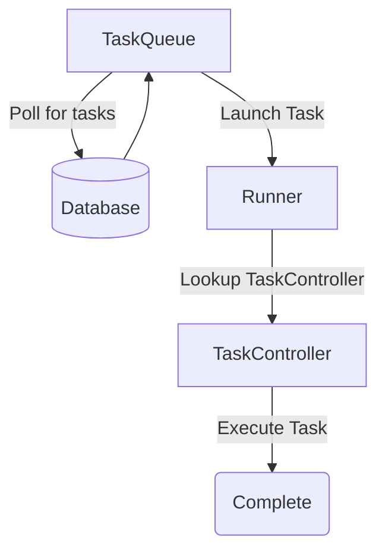
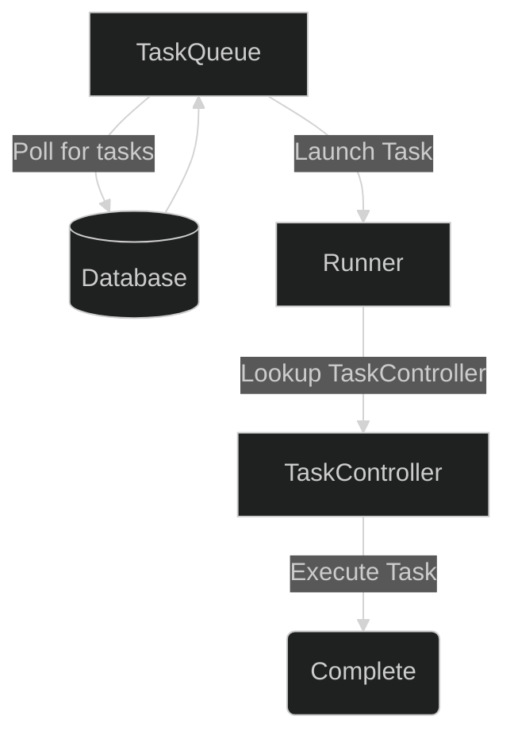
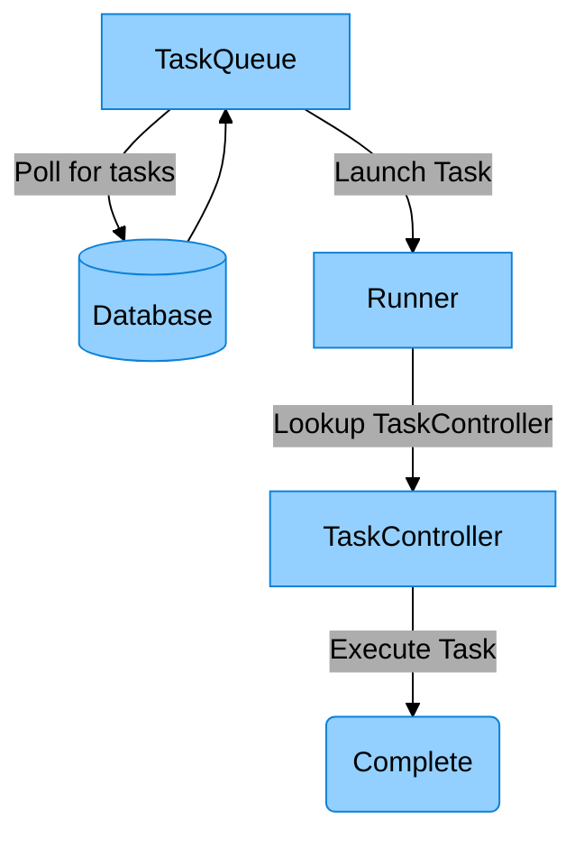

## Custom Theme override tweak

```mermaid
%%{
  init: {
    'theme': 'base',
    'themeVariables': {
      'primaryColor': '#93D0FF',
      'primaryTextColor': '#000',
      'background': '#666'
    }
  }
}%%
flowchart TD;
    queue[Queue] -- Query for Items --> db[(Database)]
    db --> queue
    queue -- Found Item --> process[Process]
```

## No Theme at all

```mermaid
flowchart TD;
    queue[TaskQueue] -- Poll for tasks --> db[(Database)]
    db --> queue
    queue -- Launch Task --> runner[Runner]
    runner -- "Lookup TaskController" --> controller[TaskController]
    controller -- Execute Task --> complete(Complete)
```

----

## Explicit dark theme

```mermaid
%%{init: {'theme': 'dark'}}%%
flowchart TD;
    queue[TaskQueue] -- Poll for tasks --> db[(Database)]
    db --> queue
    queue -- Launch Task --> runner[Runner]
    runner -- "Lookup TaskController" --> controller[TaskController]
    controller -- Execute Task --> complete(Complete)
```

## Custom Theme override

```mermaid
%%{
  init: {
    'theme': 'base',
    'themeVariables': {
      'primaryColor': '#93D0FF',
      'primaryTextColor': '#000',
      'primaryBorderColor': '#0D80D8',
      'lineColor': '#000',
      'secondaryColor': '#ADADAD',
      'tertiaryColor': '#DDF0FF',
      'tertiaryBorderColor': '#0D80D8'
    }
  }
}%%
flowchart TD;
    queue[TaskQueue] -- Poll for tasks --> db[(Database)]
    db --> queue
    queue -- Launch Task --> runner[Runner]
    runner -- "Lookup TaskController" --> controller[TaskController]
    controller -- Execute Task --> complete(Complete)
```

